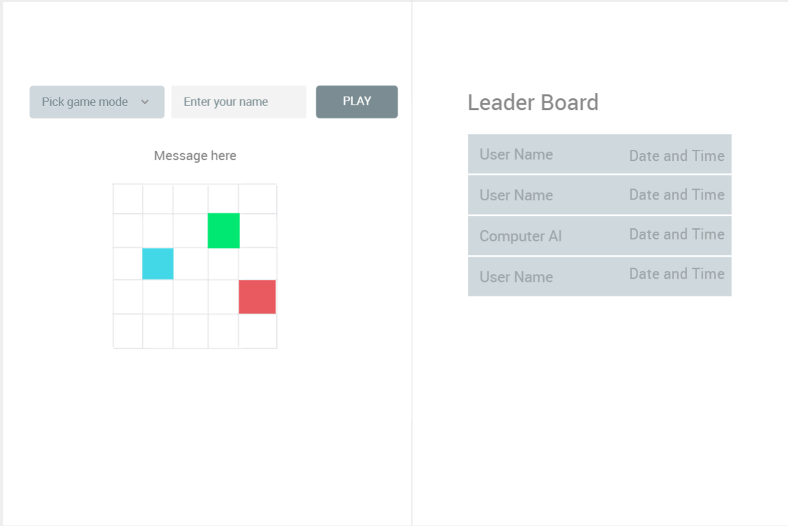

# Задача:
* Реализовать игру согласно ТЗ (здесь не приводится).
* Визуально оформить по примеру приложенного изображения.

# Примечания к реализации:
* Если данные должны использоваться более чем одним компонентом, то они хранятся в Redux.
* Если данные должны храниться только в одном компоненте, то они могут храниться в локальном стейте, в реф-е, в полях класса и др.
* Для корректной передачи функции вместе со своим окружением в таймер используются классовые компоненты. Во всех остальных случаях используются функциональные компоненты.

// !! Заменить aspect-ratio 
// !!! Дописать сюда об адаптивноси